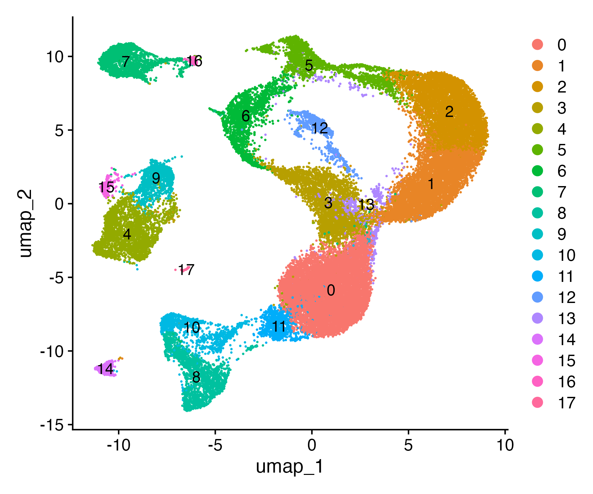
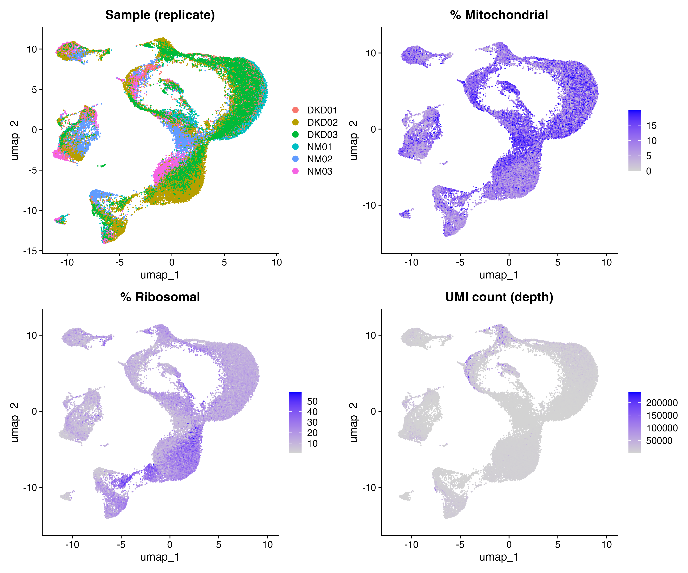
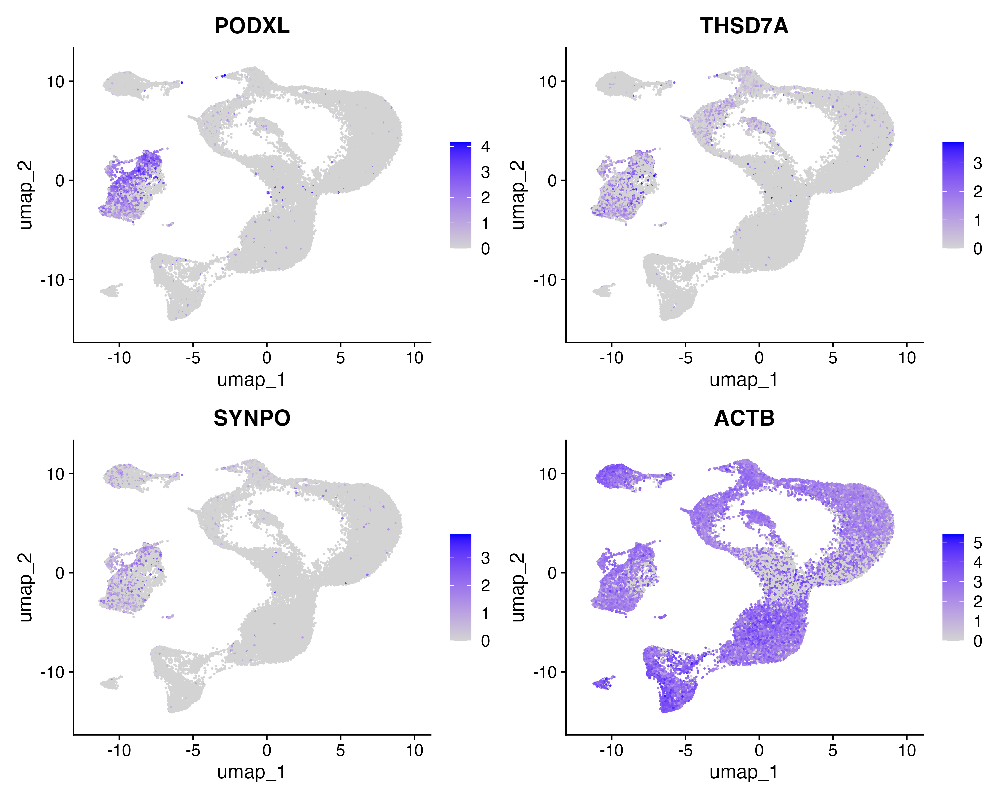
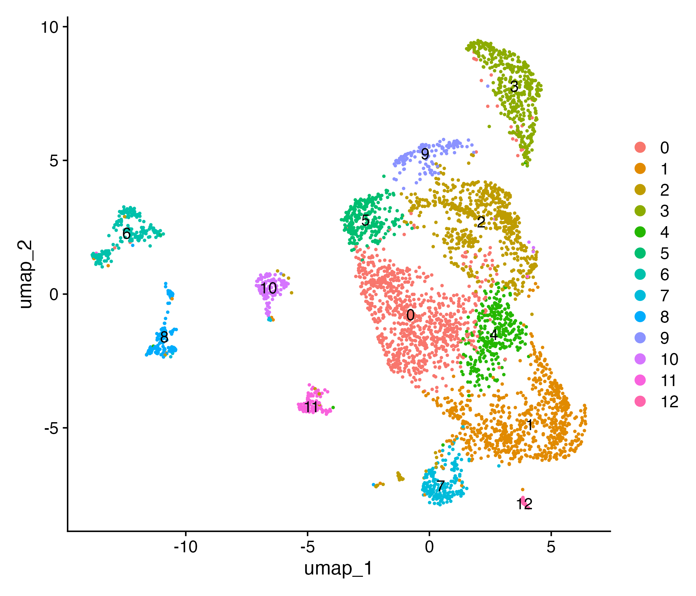
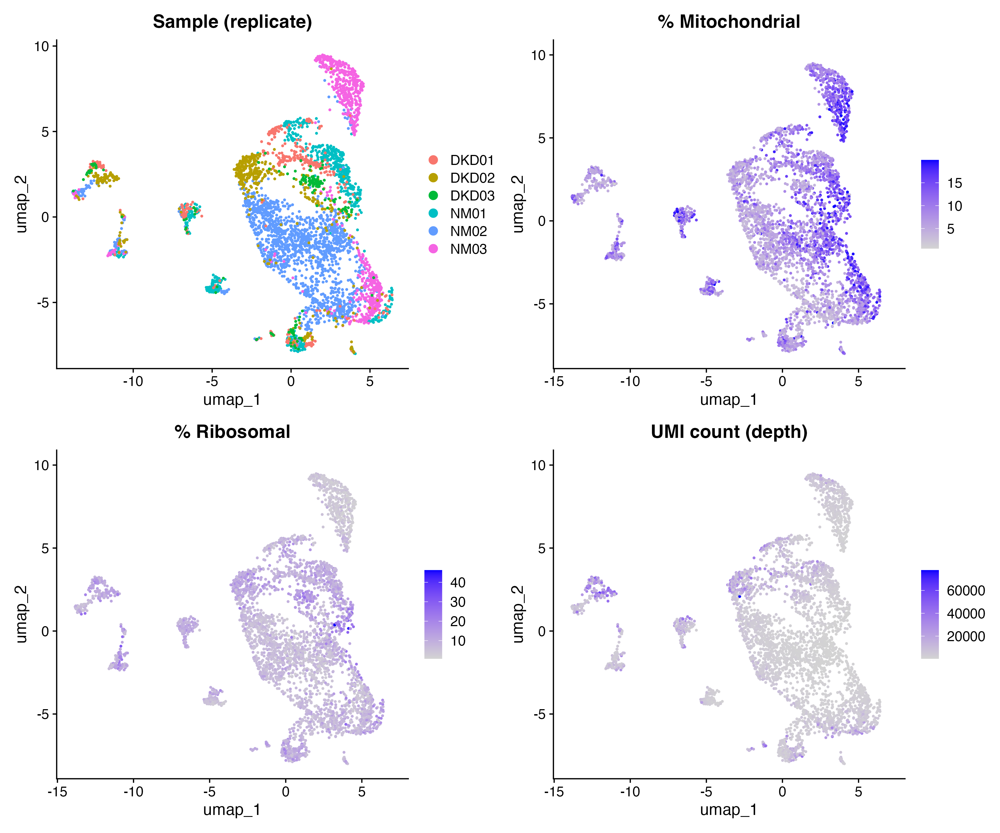
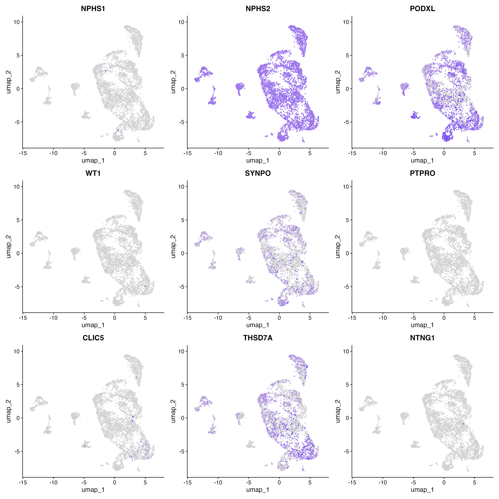

## Phase I: Find FSGS/podocyte-relevant data

Goal: find scRNA-seq datasets containing podocytes (and other cell types)
to get a sense of podocyte gene expression programs — healthy and
diseased, where available. FSGS is a medically unambiguous acronym, so
metadata tagged with it should be a reliable filter.

### GEO search

- `entrez_search()` pulls a max of 30 records per query with these filters
  — doesn't return much metadata itself, ran through `entrez_summary()`
  after to get that.
- Tried first without an `Organism` filter; restricted to Human, since the
  goal is human dysregulation specifically.
- Ran `entrez_summary()` in a loop across all matched records (one NCBI
  query per record) to build a table.
- Manually examined the resulting list of 29 records.

### Bioinformatic filtering — didn't work well

Tried excluding by keyword:

```r
exclude_terms <- c("organoid", "iPSC", "embryonic", "mouse", "murine",
                    "E18.5", "DNase", "chromatin accessibility",
                    "methylation", "GWAS")
```

This dropped records that were actually useful (string matching missed
hyphenation/phrasing differences, and some depositor metadata just
doesn't contain the terms you'd expect). Switched to manual inspection
instead — more reliable given inconsistent submitter metadata. From that,
kept records [7] and [22] from the original list, then did further manual
review (with Claude) to arrive at the 4 datasets below.

### Selected datasets

| GSE | Design | Assay | Status |
|---|---|---|---|
| GSE209781 | 3 healthy, 3 diabetic kidney disease | 10x scRNA-seq | Downloaded, extracted, confirmed standard barcodes/features/matrix format |
| GSE131882 | 3 healthy, 3 early diabetic nephropathy | snRNA-seq (10x, zUMIs pipeline) | Known-good from literature review — missed by GEO keyword search since it's single-*nucleus*, not "single cell" in title |
| GSE195797 | n=2, PEC/crescent formation study | 10x scRNA-seq | Glomerular tissue, likely contains podocytes; small n |
| GSE270701 | n=1, pediatric SRNS (CoQ10 nephropathy) podocytopathy | 10x scRNA-seq | Disease-relevant but single patient |

### Download & inspection

- Used `getGEOSuppFiles(..., fetch_files = FALSE)` first to list available
  files and URLs before downloading anything — lets you check file types
  (standard 10x trio vs. something else) and catch surprises (e.g. a
  single bundled `_RAW.tar` vs. flat files) before committing to a
  download.
- Downloaded with `getGEOSuppFiles("GSE131882", fetch_files = TRUE, baseDir = "data/raw")`
  (same pattern for all 4).
- Unzipped and visually inspected files — all 4 are standard 10x
  triplet filesets (`barcodes.tsv.gz`, `features.tsv.gz`, `matrix.mtx.gz`)
  **except**:
  - **GSE195797**: single combined matrix (not per-sample), samples
    distinguished by barcode suffix — split into `RPC_CTL` (control) and
    `RPC_TR` (treated/disease), 3,283 and 2,825 cells respectively,
    matching the n=2 from series metadata.
  - **GSE131882**: files are `.rds.gz`, but turned out to be
    **double-gzipped** (GEO wrapped an already-compressed `.rds` in a
    second gzip layer) — needed manual double-decompression before
    `readRDS()` would recognize the file. Contents are zUMIs output
    (`$umicount$inex$all` = UMI-deduplicated, exon+intron counts,
    appropriate choice for snRNA-seq). Gene IDs are Ensembl (`ENSG...`),
    not symbols — will need ID conversion before marker-gene lookups.
    
## Phase II: Seurat analysis for each dataset

A separate notebook was made to process the raw data from each of the 4 studies into a separate Seurat object

## Dataset 1: GSE209781

**Samples:**
Healthy: NM01, NM02, NM03
Diabetic Kidney Disease: DKD01, DKD02, DKD03

### Empty droplet removal

Loaded NM01 first as a test: 6,794,880 raw barcodes → 26,266 "real" cells
via `emptyDrops()`. Still much higher than the ~5k cells/sample the paper
reported — threshold for calling a good cell was too permissive at that
stage. Loaded into Seurat to look more carefully.

This revealed a lot of retained cells that weren't usable for analysis.
Still, `emptyDrops()` alone was a necessary first step — Seurat was
freezing trying to process the full 6.8M raw barcodes directly, so
dropping empty droplets first was required just to make the data
tractable before further filtering. The above was exploratory (one
sample, by hand); once understood, all 6 samples were processed together.

### Standard filtering + merge

Ran `emptyDrops()` per sample, then standard Seurat QC filtering
(min genes/cell, max % mito) on each, then merged all 6 into one Seurat
object with sample and condition (healthy/DKD) labels attached.

### Clustering (whole dataset)

`JoinLayers()` → `NormalizeData()` → `FindVariableFeatures()` →
`ScaleData()` → PCA. Elbow plot showed 10 PCs was a reasonable cutoff.
`FindNeighbors()` → `FindClusters()` → `RunUMAP()`.


*Clustering on all data (disease + control, 3 samples each) yields 17
clusters.*

### Technical validation

Checked sample of origin, % mitochondrial, % ribosomal, and nCount_RNA
(depth proxy) across the UMAP.


*Checking for batch/technical drivers of clustering.*

### Podocyte marker overlay (whole dataset)


*Some podocyte markers show low expression across the dataset overall
(PODXL, THSD7A, SYNPO shown; ACTB as expression control) — but these
still point to one "island" of clusters off to the side of the main UMAP
as the likely podocyte population.*

### Subclustering

Pulled out the candidate podocyte clusters and reclustered them alone.


*Reclustering just the candidate podocyte clusters yields 12 new
clusters, including several "islands" not resolved in the full-dataset
clustering.*

### Technical validation (subcluster)

Same checks as before, run on the podocyte-only subset.


*Cluster 3 (top) may be unique to healthy samples, though not consistently
across all 3 healthy replicates. Most other subclusters show a mix of
samples. Good starting point for defining sets/subsetting criteria for
healthy-vs-disease DE going forward.*

### Podocyte marker overlay (subcluster)


*NPHS1 is low-expressed across the whole dataset, but NPHS2 is robust
across all podocyte subclusters. PODXL is also a broad marker; the
remaining markers show expression to a lesser, more cluster-restricted
extent.*


